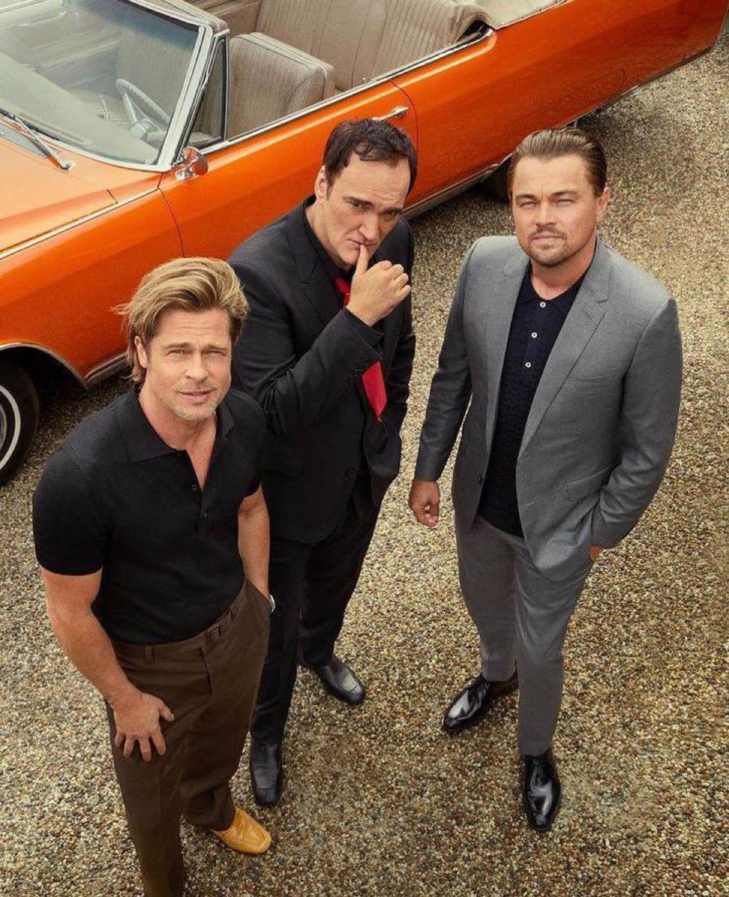
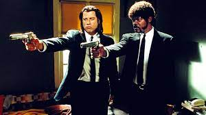
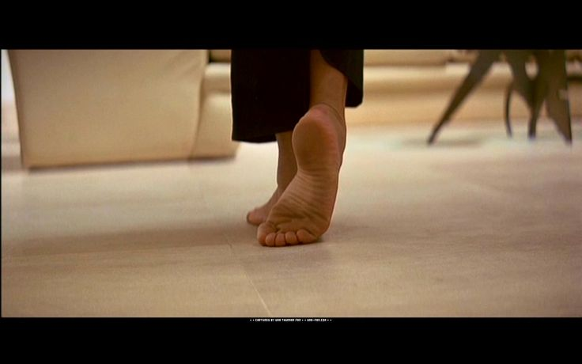
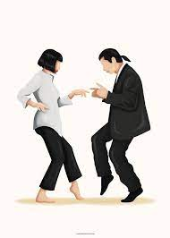
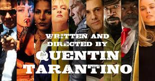

QUENTIN TARANTINO ANALYSIS

I decided to base my project in one of my favorite directors, Quentin Tarantino. For that, I explored some datasets and webs to find all the information needeed to complete my studio. I set it into 3 diferent analysis: A script sentiment analysis, some general data/information about the director and his movies and finally a regression model to try to estimate the keys of success of his movies. 

Tableau link: https://public.tableau.com/app/profile/gonzalo.quesada/viz/Tarantino_16775583352980/Story1?publish=yes

1. Script reading and Sentiment Analysis (CSV and Visualization)
    
I decided (and luckly found) the script of his opera magna: Pulp Fiction. In the CSV file there were every line, character and location of every situation that happened in the film. I decided to avoid spoilers, so I didn´t take into account the final decease/survival of the character to avoid anyone to see this masterpiece in the future. 

First of all, there are some recurrent points of Tarantino, such as the selection of the music, the angle of the camera or the easter eggs and references from other movies. As normally this tools are visual and not reflected in the script, I wanted to know if it is any way of finding out if the script is also full of QT references. I decided to take two of the most typical to make a quick regex analysis: 

THE FEET: Tarantino has a fetish, it is not a big secret. I decided to use regex to find how many times the word feet, foot, shoes, socks... were used on the film, which argument has no correlation with the pedestrian nor podology world. The final count was 24, so we can conclude that not only as an image, but the feet fetish is present also in the script. It is kind of savage, as doing an nltk, as the word most repeated word in the film is only used 91 times. Of course, it is "fuckin". 

THE BRAND: It is well known that Tarantino does not like Brand Placement in his movies, that is why he decided to invent some of his own. In all his films, the cigarrete brand "Red Apple" is present in practically every scene, and in this particular film the most iconic scene includes the fictional brand "Big Kahuna Burger". I try the same analysis as the director's fetish, with disappointing results: both fictional brands were only said twice in the whole movie, in one scene each. So the Fictional Brand Placement does not affect the script, is just presented casually in the scene. 

THE GENDER INEQUALITY: THE BECHDEL TEST

For the second part of my first part of the study, I decided to find out if the film passes what we can consider possibly the easiest and yet most difficult test of gender inequality in Hollywood cinema: The Bechdel Test. In this simple test, we have a boolean response: We pass it if: 
    - There is at least two women with names present in the film
    - They speak to each other
    - The conversation is not related to a man.
Seems easy, right? But unfortunately, most of the Hollywood classics are unable to pass it. And in my opinion, after seeing Reservoir Dogs recently, I thought that this movie was also unable to pass it, as the only femenine character I remembered of Pulp Fiction was Mia, interpreted by Uma Thurman, and was mostly interacting with Vincent Vega (John Travolta). 

I create a set of women that has lines and which character had a name, and do a loop to know if their interactions were line-to-line, as well as if they share the same scene...

And the film passed it! Two side characters, Judy and Trudi, shared a breef conversation about piercings. Expect the unexpected.

THE SENTIMENT ANALYSIS
Finally, I decided to study the main characters and create a new dataframe grouped by character. I just pick 15 of them, the ones with most lines (a minimum of 20, a relative low bar but really high as they are A LOT) and complete the table with the word count per character, the ratio word count/lines, the times this person has been mentioned by other character, the ratio mentioned/lines and finally a mean of the sentiment analysis per character. It was interesting to know that 5 out of the 15 characters with more lines were women, as well as that QT is present in this top. Vincent and Jules, the Iconic Duo, are the ones that are on top of the characters with most lines, although Marsellus Wallace and The Wolf are the ones most mentioned, as well as the ones with the highest quality of word count per line. Are also the most bipolar: The Wolf is the most positive according to the sentiment analysis, and Marsellus the most negative. (Just per curiosity, having an actor as Christopher Waltz and him not being in the top 15 characters with more lines is a clear indicator of the deep cast of Tarantino movies).

In addition, I tried more sentiment analysis on a couple of factors: 
First of all, the sentiment during the day is more negative that during night. 
Then, ordered by place, the garage is the place with less valuation while the phone call between Butch and Fabienne, the "happiest scene"
Finally, i grouped by gender and I was stunned as the male has more positive sentiment than women. 

2. General data about Tarantino films (CSV, Web Scrapping, MySQL, Visualization)

The second part of my test was kind of generic: I wanted to explore Tableau and its options, and find out some basic curiosities of Tarantino films. For that I used some CSV, import them into SQL to export them using Joins, and some web scrapping of the information I needed that was not in the CSVs I used, such as the prices or the nominations. There are a couple of issues that made my study less efficient: First of all, I wanted to use the IMDB API but it was hard to reach, so I turned into the TMDB CSVs, which I thought was as complete but I found out that the last film was not included. Sorry Once upon a time in Hollywood. Secondly,I had a big problem with Kill Bill. According to the director is just one film, so in some databases it is included as such, but as it was split in two parts, there were different actors, different release dates, different revenues... I hope I didn't mixed up the data, as some of it was considering it as one film and other sources as 2. Lastly, I imported a really cool CSV that sets the Death and curse count per minute of each film, but it was created before the Heighful Eight and there is some data missing: I will use this CSV for visualization but not for the final regression, as I will web scrappe more exact source. This were the basic conclusions of the analysis: 

    - The movie with most deaths is Kill Bill Volume I with 63, and the one with less is Jackie Brown with 4 (remember that not all movies are included in this analysis). 
    - The film with more curses is Pulp Fiction with 469, while the one with less is Kill Bill Vol. I, With 57
    - The minutes with the highest death count are between the 80 and 90 counting all the film. The minutes with more curse words are between the 15 and the 20
    - The most recurring actors in QT philmography are both Samuel L Jackson and Zoe Bell, with 6 apparisons. Quentin Tarantino has appeared in all his movies, some times as a side actor, others doing a cameo and others as narrator. 
    - There is not one film without profits in Tarantino filmography: the one that was closest to the loss was Death Proof, and the ones with more ratio of benefit were Pulp Fiction and Reservoir Dogs. 
    - Taking into account the total of the Golden Globes, BAFTA Awards and Oscars, the films that won more prices were both Django Unchained and Pulp Fiction. All of QT's prices (8 in total) are from best original script. The film with more nominations is Once Upon a Time in Hollywood. 
    - The longest film from Quentin is the Hateful Eight with 167 minutes. If we consider Kill Bill as a pack, it sums a total of 247 mintues. The shortest film is Reservoir Dogs, with 99 minutes. 
    - Finally and most important for my regression in the next step; 

3. Regression model on the Film Nº10

Lastly, I tried to do the lineal regression Model of the last film that Tarantino will direct. As he said, after the 10th movie, he will retire (him considering both KILL BILL volumes as 1 film), to avoid finishing without passion and do a mediocre work as a director. My first aim was to try to find the correct factors to maximize the Rating of the movie, according to exogenous variables that can be controlled before the release: I set up boolean variables for the actors that had more presence in Tarantino's filmography (himself as an actor, himself in a Cameo, Samuel L. Jakson, Zoe Doll, Michael Madsen and Tim Roth), as well as the budget, the Position (order of the movie from older to newer), the duration of the movie and the death count. I tried an OLS and it just exploted: there were too many exogenous variables for just 10 number of observations. So I decided to split and compare two different regressions: One of booleans of all the appearances of the actors, and other of the rest of the factors. Neither worked, as the only p-value less than 0.1 was Quentin Tarantino doing cameos. I then proceed to calculate the VIF without conclusive results, as it seems that all the variables were highly correlated, and the Multicolienality was present with any possible combination. 

So then, I decided to make a twist: instead of trying to guess the rating of the next movie, I want to try to make a regression with the endogenous variable being the total revenue (not taken into account in the last process). It seems more plausible with exogenous variables such as the rating and the original budget to try to regress the revenue. And it work (sort of). The final combiantion acceptable with an alpha of 1 was to take the exogenous variables: Budget, the presence of Tim Roth in the film, the presence of Michael Madsen, the nominations of the film to the combination of Oscars, Golden Globes and BAFTAs and the IMDB Rating of the film. In this model, and with an alpha of 0.1 (accepting octopus as a pet), the only exogenous variable with higher p-value is by little the Michael Madsen presence: the most relevant one, both by coefficient and t, is the budget, and the most negative impact on the revenue is the presence of Tim Roth. i don't know why, he is a hell of an actor. 

                     OLS Regression Results                            
==============================================================================
Dep. Variable:                      y   R-squared:                       0.972
Model:                            OLS   Adj. R-squared:                  0.938
Method:                 Least Squares   F-statistic:                     28.19
Date:                Tue, 28 Feb 2023   Prob (F-statistic):            0.00324
Time:                        03:10:39   Log-Likelihood:                -183.65
No. Observations:                  10   AIC:                             379.3
Df Residuals:                       4   BIC:                             381.1
Df Model:                           5                                         
Covariance Type:            nonrobust                                         
==============================================================================
                 coef    std err          t      P>|t|      [0.025      0.975]
------------------------------------------------------------------------------
const      -6.574e+08   2.92e+08     -2.254      0.087   -1.47e+09    1.52e+08
x1             2.0109      0.597      3.371      0.028       0.355       3.667
x2         -1.117e+08   3.66e+07     -3.050      0.038   -2.13e+08      -1e+07
x3          6.629e+07   3.24e+07      2.045      0.110   -2.37e+07    1.56e+08
x4          2.512e+07   8.42e+06      2.984      0.041    1.74e+06    4.85e+07
x5          9.484e+07   3.96e+07      2.398      0.075    -1.5e+07    2.05e+08
==============================================================================
Omnibus:                        1.659   Durbin-Watson:                   2.321
Prob(Omnibus):                  0.436   Jarque-Bera (JB):                1.046
Skew:                          -0.731   Prob(JB):                        0.593
Kurtosis:                       2.391   Cond. No.                     1.32e+09

